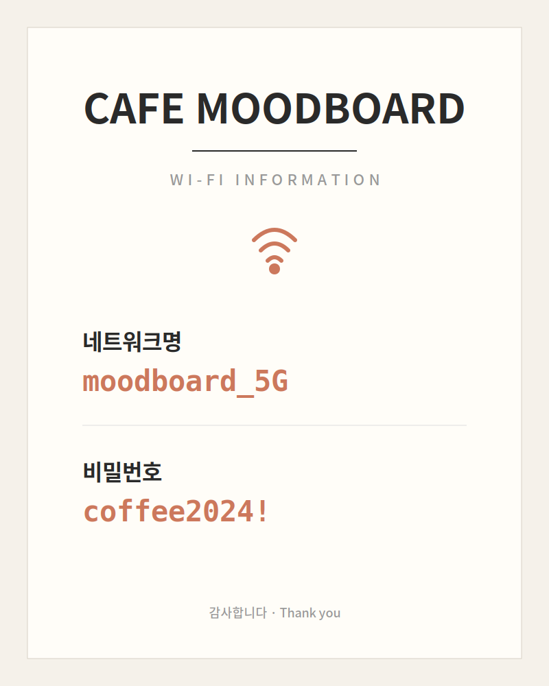
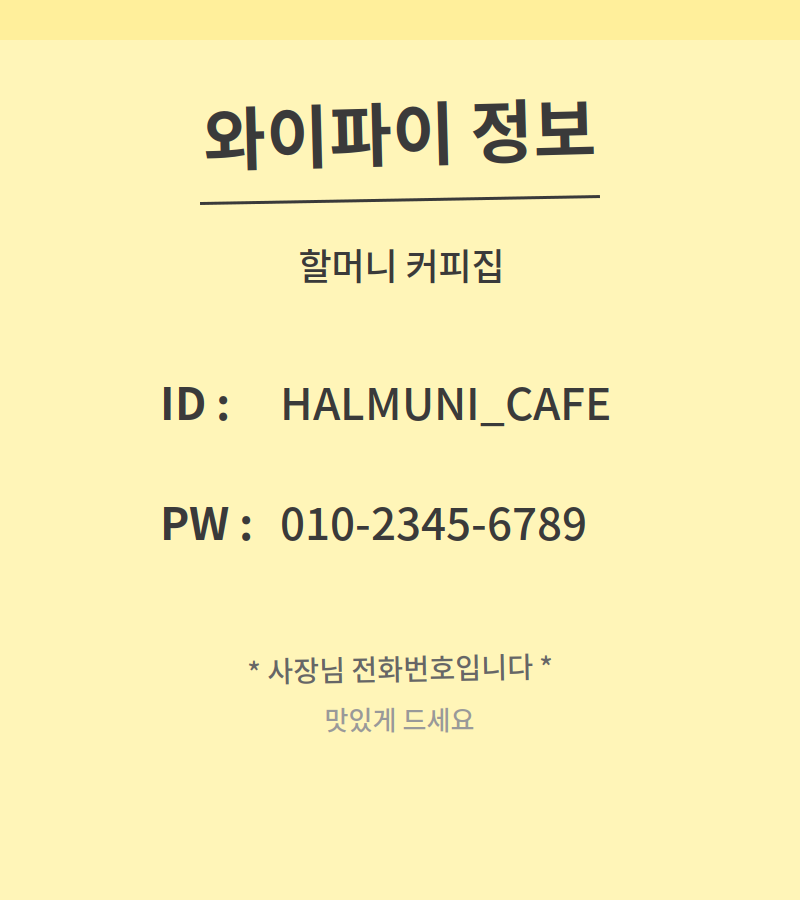
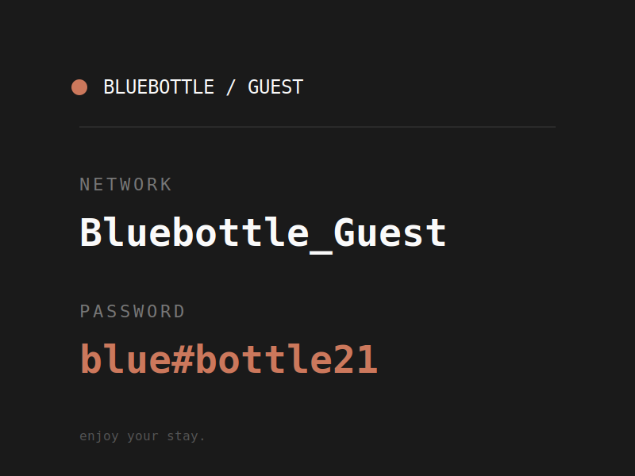

# iq-wifi-snap

> 사진 한 장으로 와이파이 끝. 카페·매장에서 와이파이 정보를 찍으면 **SSID 추출 → QR 코드 → 데스크톱 명령어 → 친구한테 링크 공유**까지 한 번에.

iq-agent-lab의 첫 번째 일상 유틸리티 에이전트. 정적 호스팅(GitHub Pages) · 백엔드 0 · BYO API key.

**Live demo**: https://iq-agent-lab.github.io/iq-wifi-snap/

---

## 동작 방식

```
[사진/업로드] ──▶ Claude Vision API ──▶ {ssid, password, security}
                                          │
                                          ├──▶ WiFi QR 생성 (폰 카메라로 스캔하면 자동 접속)
                                          ├──▶ macOS/Windows/Linux 명령어 (복사해서 터미널 실행)
                                          ├──▶ 위치(GPS)와 함께 기록 → 재방문 시 자동 복원
                                          └──▶ 공유 링크 생성 → 친구도 API 키 없이 즉시 사용
```

- **순수 정적 웹앱 + PWA**: HTML/CSS/Vanilla JS · 빌드 단계 없음
- **백엔드 없음**: 모든 처리는 브라우저에서. API 키는 localStorage에만 저장
- **CORS**: `anthropic-dangerous-direct-browser-access: true` 헤더 활용
- **모델**: Claude Haiku 4.5 기본 (저렴 · OCR 수준 충분), Sonnet 4.6 옵션
- **PWA**: 홈 화면 설치 가능, 오프라인 셸 캐싱
- **장소 기억**: GPS와 함께 저장, 100m 이내 재방문 시 자동 복원
- **공유**: 카톡·메시지·AirDrop 등 시스템 공유 시트. 받는 사람은 API 키 없이 링크 클릭만으로 QR 확인.

---

## 📸 테스트 예시

`examples/` 폴더에 실제 카페에서 볼 법한 와이파이 정보 카드 3종이 들어있습니다. 추출 정확도 + 다양한 레이아웃 대응 테스트용.

### 사용 방법

**A. 모니터에 띄워서 폰으로 촬영** — 앱의 "카메라 열기"로 인앱 촬영. 화면 반사 + 약간의 기울기까지 있어서 실제 카페 시뮬레이션에 가까움.

**B. 이미지 직접 업로드** — 앱의 "파일 업로드" 버튼으로 PNG 직접 전달. AI 추출 로직만 깔끔하게 테스트.

### Card 1 — 모던 카페 안내문 (난이도: 쉬움)



- 깔끔한 인쇄물 스타일, 한글 라벨 `네트워크명` / `비밀번호`
- 진한 코랄색 강조, monospace 폰트로 SSID/PW 분리
- **정답**
  - SSID: `moodboard_5G`
  - PW: `coffee2024!`
- **체크 포인트**
  - SSID 끝의 `_5G` 누락 안 되는지
  - PW 끝의 `!` 누락 안 되는지

### Card 2 — 손글씨 메모지 (난이도: 중간)



- 노란 포스트잇 컨셉, `ID :` / `PW :` 라벨
- 전화번호 형식의 비밀번호 — 한국 카페에서 흔한 패턴 (사장님 휴대폰 번호를 그대로 사용)
- **정답**
  - SSID: `HALMUNI_CAFE`
  - PW: `010-2345-6789`
- **체크 포인트**
  - `ID :` 를 SSID 라벨로 잘 매핑하는지
  - 전화번호 형식을 SSID로 오인하지 않는지
  - 하이픈(`-`) 그대로 보존하는지

### Card 3 — 미니멀 다크 스티커 (난이도: 중간-어려움)



- 어두운 배경 + 영문 `NETWORK` / `PASSWORD` 라벨
- 특수문자(`#`)와 대소문자 혼용 PW
- **정답**
  - SSID: `Bluebottle_Guest`
  - PW: `blue#bottle21`
- **체크 포인트**
  - 어두운 배경에서도 OCR 정확도 유지하는지
  - `#` 같은 특수문자 누락 없이 가져오는지
  - 대소문자 (`Bluebottle`) 정확히 보존하는지

### 회귀 테스트 용도

이 카드들은 단순 데모를 넘어 **추출 프롬프트의 회귀 테스트 픽스처** 역할도 합니다.

- `lib/claude.js`의 프롬프트를 수정한 뒤 → 이 3개 카드를 모두 정확히 추출하는지 확인
- 실사용에서 잘못 추출되는 케이스를 발견하면 → 그 사진을 `examples/`에 추가하고 프롬프트의 few-shot 예시 보강

---

## 로컬에서 실행

```bash
cd iq-wifi-snap
python3 -m http.server 8000
# → http://localhost:8000
```

처음 접속 시 설정 → Anthropic API 키 등록 → 카메라 권한 허용.

위치 기억 기능 쓰려면 설정 → "위치 기억" 토글 ON (위치 권한 요청됨).

> 카메라/위치 API는 `localhost` 또는 HTTPS에서만 동작. GitHub Pages는 HTTPS라서 문제없음.

---

## GitHub Pages 배포

Settings → Pages → Source `Deploy from a branch` → `main` / `(root)`.

배포 URL: **`https://iq-agent-lab.github.io/iq-wifi-snap/`**

---

## 프로젝트 구조

```
iq-wifi-snap/
├── index.html          메인 UI
├── styles.css          디자인 토큰 + 컴포넌트
├── app.js              진입점 (카메라 · 업로드 · 공유 · PWA)
├── manifest.json       PWA 매니페스트
├── sw.js               서비스 워커
├── icons/              PNG 아이콘 + SVG 원본
├── examples/           ⭐ 테스트용 와이파이 카드 이미지
│   ├── card1-modern-cafe.png
│   ├── card2-handwritten.png
│   └── card3-minimal-dark.png
└── lib/
    ├── claude.js       Anthropic API + 추출 프롬프트
    ├── wifi.js         WiFi QR 문자열 + OS 명령어
    ├── location.js     GPS + Haversine 거리
    ├── share.js        공유 URL + Web Share API + QR PNG
    └── storage.js      localStorage 래퍼
```

---

## 사용 흐름

### 처음 카페 방문
1. 홈 화면 아이콘 탭 (PWA 설치한 경우)
2. **카메라 열기** → 와이파이 정보 촬영
3. SSID/PW 추출 → 결과 화면
4. (필요 시) SSID/PW 직접 수정 → **QR 갱신** 버튼
5. **공유** 버튼 → 친구한테 카톡으로 전송, 또는
6. **QR 저장** → 이미지 파일로 다운로드, 또는
7. 폰: QR 비추기, 노트북: 명령어 복사 후 터미널 실행

### 같은 카페 재방문
1. 앱 열기 → 상단에 "근처에서 사용했던 와이파이" 자동 표시 → 탭

### 친구가 공유받은 링크 열기
1. 카톡에서 링크 클릭
2. 자동으로 결과 화면 + "📨 공유받은 와이파이 정보예요" 배너
3. QR 비추기 → 접속

---

## 공유 링크 형식

```
https://iq-agent-lab.github.io/iq-wifi-snap/?wifi=<base64>
```

base64 안에 SSID/PW/security만 들어있어서 받는 사람 데이터로는 0바이트만 소비. 본인 API 키 없어도 작동. 공유받은 정보는 받는 사람의 history에 자동 저장되지 않음.

---

## 보안 메모

- API 키는 본인 브라우저 localStorage에만. 서버 전송 없음.
- 위치 좌표도 localStorage에만 저장. 외부 전송 없음.
- **공유 링크는 와이파이 비밀번호를 그대로 포함하므로**, 신뢰하는 사람한테만 보내세요.
- 이 사이트 URL 자체를 공개적으로 공유하지 마세요 (API 키는 본인 브라우저에만 있어서 안전하긴 하지만, 브라우저 콘솔로 추출은 가능).

---

## 로드맵

- [x] **v0.1** — 사진 → 추출 → QR + 명령어
- [x] **v0.2** — PWA화, GPS 위치 기억, 라벨링
- [x] **v0.3** — 공유 (Web Share API + 딥링크), QR PNG 다운로드, 수동 편집
- [x] **v0.3.1** — 테스트 예시 이미지 추가 (examples/)
- [ ] v0.4 — 캡티브 포털 자동 통과 보조
- [ ] v0.5 — 온디바이스 OCR 폴백 (Tesseract.js · 오프라인 상황)
- [ ] v0.6 — 데스크톱 컴패니언 (WebSocket · 페어링)
- [ ] v0.7 — 자동 속도 측정, 카페별 평균 속도 지도

---

## License

MIT
